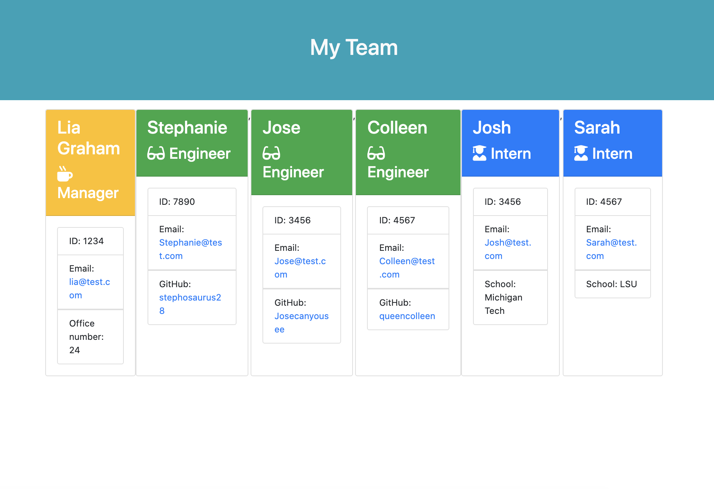

# TeamGenerator
This application will allow you to create a team webpage so that you have access to their information.

# Summary

This application is a Node Command Line Interface (CLI) that takes in information about employees and generates an HTML webpage that displays summaries for each person. 

## User Story 

```
As a manager
I want to generate a webpage that displays my team's basic info
so that I have quick access to emails and GitHub profiles
```

## Demo Webpage



## Dependencies

* [jest](https://jestjs.io/) for running the provided tests
* [inquirer](https://www.npmjs.com/package/inquirer) for collecting input from the user.

## Getting Started

After cloning the repository, run `npm install` to ensure dependencies are ready to use. 

* To run the application, type  `node app.js` in the command line.
  * The application will prompt the user to build an engineering team. An engineering
team consists of a manager, and any number of engineers and interns.
  * The applicatioon will generate a `team.html` page in the `output` directory, that displays a nicely formatted team roster. Each team member should display the following in no particular order:
    * Name
    * Role
    * ID
    * Role-specific property (School, link to GitHub profile, or office number)

* To run the tests within the application, `npm run test`

## MVP

* Functional application.

* GitHub repository with a unique name and a README describing the project.

* User can use the CLI to generate an HTML page that displays information about their team.

* All tests must pass.
